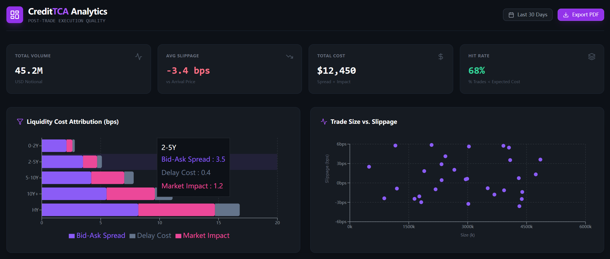
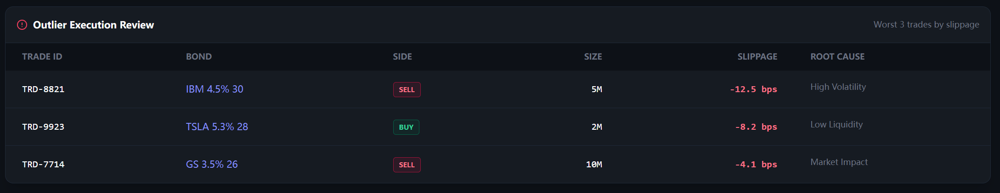

# Quantitative Pre-Trade TCA Framework for Credit Trading
### Institutional-Grade Cost Analysis & Execution Probability Engine

## Overview

This project implements an institutional-grade **Pre-Trade Transaction Cost Analysis (TCA)** system designed for the Credit Bond market. It transitions execution strategy from empirical intuition to a **probability-calibrated framework**.

By leveraging **Ridge Regression** for cost estimation and **Isotonic Calibrated Logistic Regression** for execution probability, the system quantifies the risk of "blind flying" in OTC markets. 

It features a **Full-Stack Dashboard (React + Flask)** to visualize cost attribution, slippage analysis, and outlier detection in real-time.

---

## 📊 Dashboard Preview

<p align="center">
  
  <br>
  <em>Figure 1: Main Analytics Dashboard showing Cost Attribution and Trade Slippage vs Size.</em>
</p>

<p align="center">
  
  <br>
  <em>Figure 2: Detailed Outlier Review and Execution Quality KPIs.</em>
</p>

---

## Key Features

### 1. Data Engineering & Validation (Module 1)
* **Strict Walk-Forward Validation:** Eliminates look-ahead bias
* **Issuer-Level Aggregation:** Solves the sparse data problem in credit markets by aggregating liquidity metrics across an issuer's entire bond curve when specific bond data is missing.
* **VIX Integration:** Enriches trade data with macro volatility signals derived from Yahoo Finance data.

### 2. Two-Stage Predictive Engine (Module 2)
* **Cost Model (Ridge Regression):** Uses L2 regularization to handle high multicollinearity among financial features (Spread, Duration, VIX, DTS).
* **Probability Model (Calibrated Classifier):** Uses **Isotonic Regression** to map raw logistic scores to actual statistical fill rates (e.g., a 0.7 score implies a true 70% probability of execution).
* **Market Impact Modeling:** Implements the Square-Root Law with an asymmetric "Crowding Penalty" to simulate liquidity evaporation during panic selling or crowded trades.

### 3. Decision Logic & Feedback Loop (Module 3)
* **Value Trap Filter:** Calculates `Net Edge = Alpha - Predicted Cost`. Trades are rejected ("NO_TRADE") if transaction costs erode the theoretical alpha, preventing unprofitable execution.
* **Closed-Loop Calibration:** Analyzes post-trade **Reversion Ratios**. High reversion suggests temporary liquidity impact, triggering an automated increase in the model's impact beta coefficient.

---

## Project Structure

```text
Credit-Bond-TCA-System/
├── backend/                 # Python Logic & API
│   ├── src/
│   │   ├── __init__.py
│   │   ├── data_adapter.py  # Data Cleaning, VIX Fetching
│   │   ├── tca_core.py      # Ridge Cost Model & Calibrated Probability
│   │   ├── feedback.py      # Post-Trade Feedback Loop
│   │   └── visualization.py # Matplotlib Utilities
│   ├── data/                # RFQ Data (csv/parquet)
│   ├── app.py               # Flask REST API Entry Point
│   └── main.py              # CLI Simulation Entry Point
│
├── frontend/                # React Dashboard
│   ├── src/
│   │   ├── TCADashboard.jsx # Main Analytics Component
│   │   └── App.js
│   ├── public/
│   └── package.json
│
└── README.md                # Project Documentation